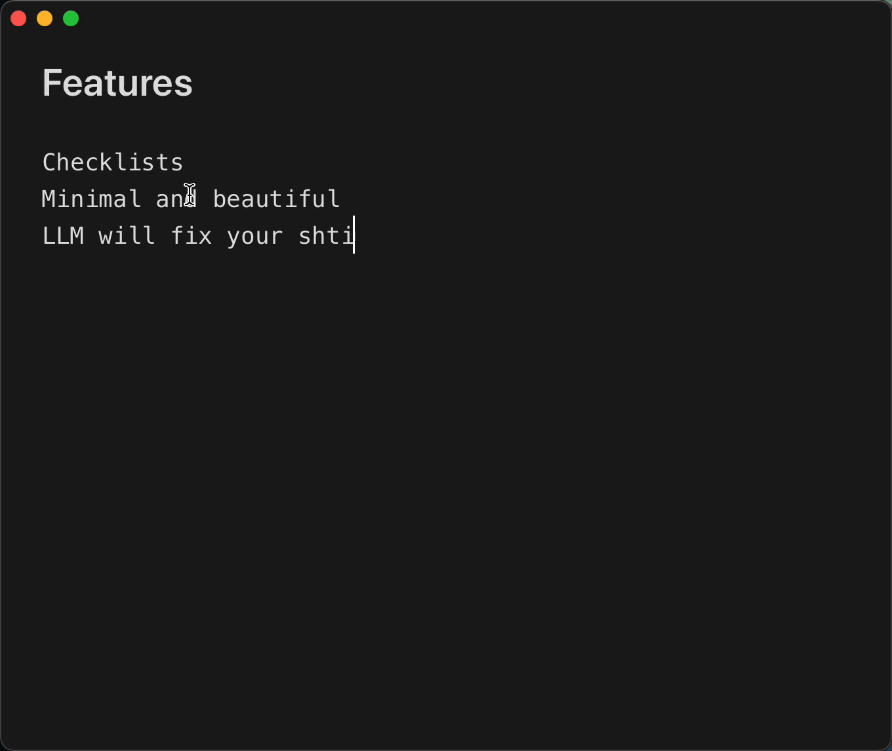

# Drift

A minimal, distraction-free markdown editor for macOS.

<p align="center">
  
</p>

## Features

- **Distraction-free writing** - Clean interface, smart cursor that fades while typing
- **Quick Open (Cmd+P)** - Fuzzy search through all your notes
- **Auto-save** - Notes save automatically to `~/Documents/Drift`
- **Auto-naming** - Files named from first heading or line
- **AI Fix (Cmd+K)** - Fix typos, grammar, fill in placeholders (requires OpenAI API key)
- **Dark/Light mode** - Toggle with Cmd+D, or follow system with Cmd+Shift+D
- **Native macOS** - Proper menus, shortcuts, and window management

## Keyboard Shortcuts

| Shortcut | Action |
|----------|--------|
| Cmd+N | New note |
| Cmd+P | Quick open |
| Cmd+K | AI fix selection/line |
| Cmd+L | Select line |
| Cmd+D | Toggle dark/light |
| Cmd+Shift+D | Use system theme |
| Cmd+Shift+N | New window |
| Tab / Shift+Tab | Indent/unindent |

## Tech Stack

- **Tauri 2** - Native macOS app
- **SolidJS** - Reactive UI
- **CodeMirror 6** - Editor
- **TypeScript** - Type safety

## Development

```bash
npm install
npm run tauri dev
```

## Build

```bash
npm run tauri build
```

App bundle will be at `src-tauri/target/release/bundle/macos/Drift.app`

## Philosophy

- **Local-first** - Notes are markdown files on disk
- **Fast** - Launches instantly
- **Minimal** - No accounts, no sync, no bloat
