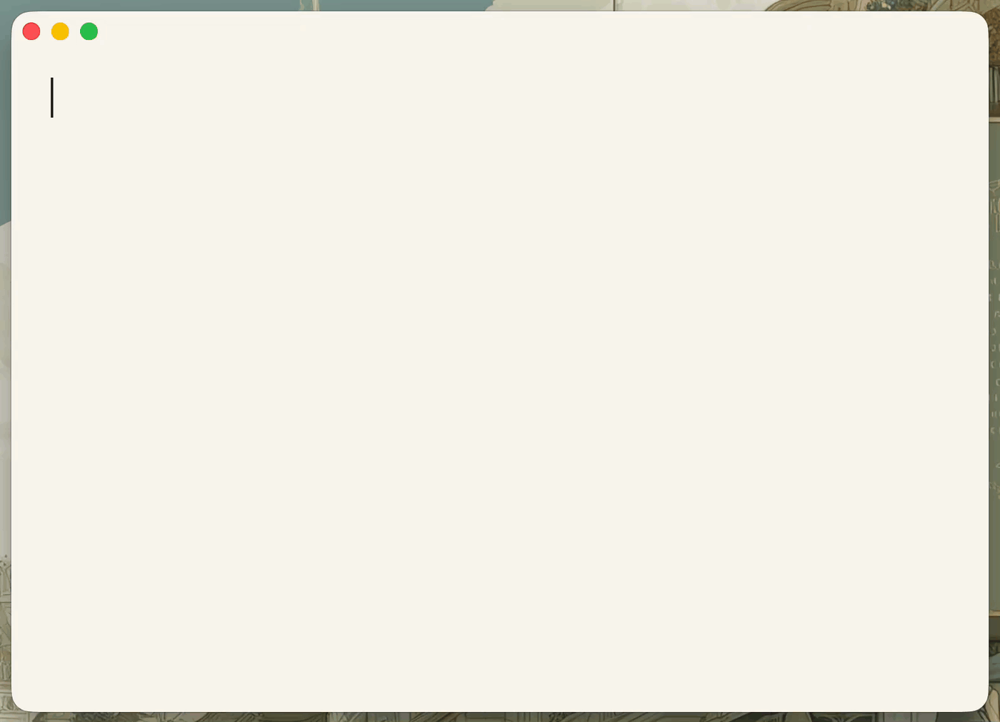
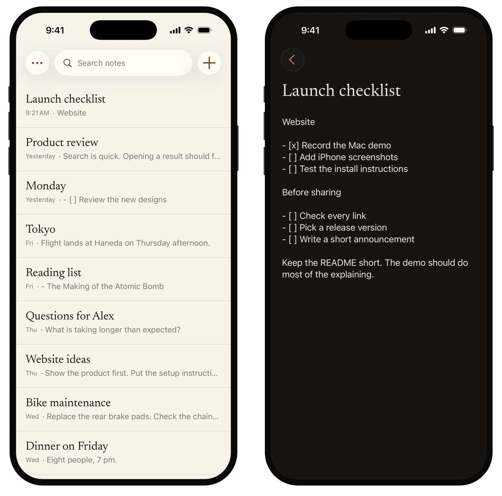

# Drift

The markdown editor I always wanted for my personal notes.

<p align="center">
  <a href="docs/assets/demo.mp4"></a>
</p>

Notes are plain Markdown files, named from their contents and saved
automatically. There is also an iPhone app.

<p align="center">
  
</p>

## Shortcuts

| Shortcut | Action |
|----------|--------|
| **Cmd+P** | Quick open |
| **Cmd+N** | New note |
| **Cmd+/** | See all the other shortcuts |

## Try it!

Clone the repo:

```sh
git clone https://github.com/cjbest/drift.git
cd drift
```

Then tell your coding agent:

> Read docs/INSTALL.md, then build and install Drift on my Mac.

For now, source builds require Xcode and an Apple account set up for development
signing. A free account is enough. Your agent can handle the remaining build
tools using the [installation guide](docs/INSTALL.md).

For iPhone and iPad, point your agent at the
[iOS instructions](docs/INSTALL.md#iphone-and-ipad). Both apps can use the same
Markdown folder in iCloud Drive.

---

Built with [Tauri](https://v2.tauri.app/), [SolidJS](https://www.solidjs.com/), and
[CodeMirror](https://codemirror.net/) on Mac; [Swift](https://www.swift.org/) and
[UIKit](https://developer.apple.com/documentation/uikit) on iPhone and iPad.
Typefaces: [Newsreader](https://github.com/productiontype/Newsreader) and
[JetBrains Mono](https://www.jetbrains.com/lp/mono/).
