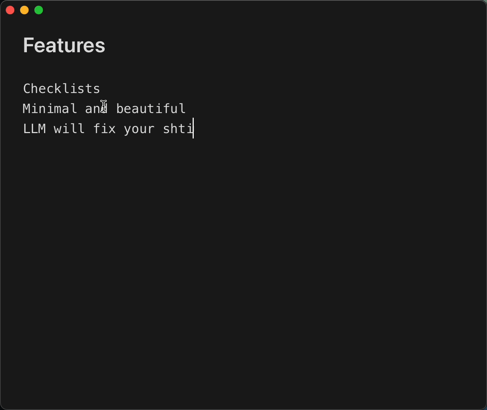

# Drift

The markdown editor I always wanted for my personal notes.

<p align="center">
  
</p>

Notes are plain Markdown files, named from their contents and saved
automatically. Cmd+P searches the notebook.

## Shortcuts

| Shortcut | Action |
|----------|--------|
| **Cmd+P** | Quick open |
| **Cmd+N** | New note |
| **Cmd+F** | Find in document |
| **Cmd+D** | Toggle dark/light |
| **Cmd+/** | Keyboard shortcuts |

Type `[]` or `-[]` followed by Space at the start of a line to begin a checklist.
Cmd+Return checks or unchecks every checklist item in the selection.

## Mac development

Build and run **Drift Preview**, a separate app that uses a development copy of
the notebook:

```bash
npm install
./scripts/preview-desktop.sh
```

To build without launching, run `npm run build:desktop-preview`. See the
[desktop guide](DESKTOP-DESIGN.md) for notebook configuration, interaction
details, and tests. Development and automated tests must use notebook copies.

`npm run build:desktop` builds the main **Drift.app**. Both desktop build
commands use an available Apple signing identity so macOS can recognize
updates and retain folder permissions. If several identities are installed,
choose one with `DRIFT_SIGNING_IDENTITY`. Configure the installed main app's
notebook as described in the desktop guide before using it with existing notes.

## iPhone and iPad

The iOS app lives in `drift-ios` and can use the same Markdown folder as the Mac
app. See the [iOS build and testing guide](drift-ios/README.md), or run
`./scripts/preview-ios.sh` for a separate simulator preview with sample notes.

---

Built with Tauri 2, SolidJS, and CodeMirror 6.
