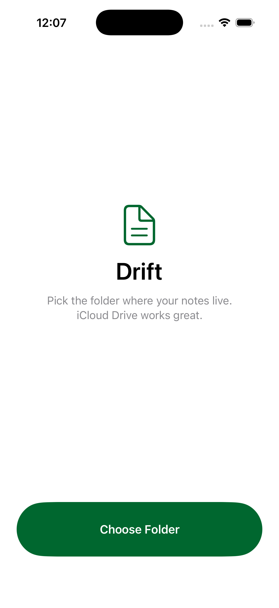
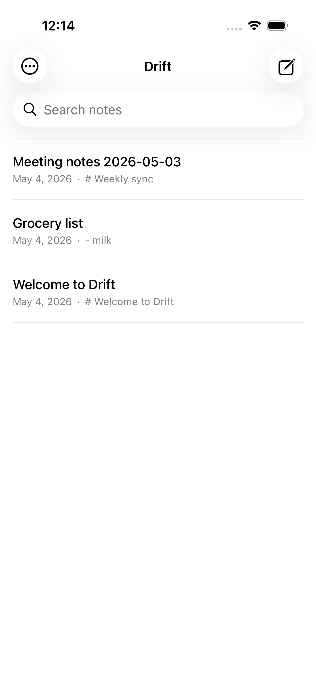
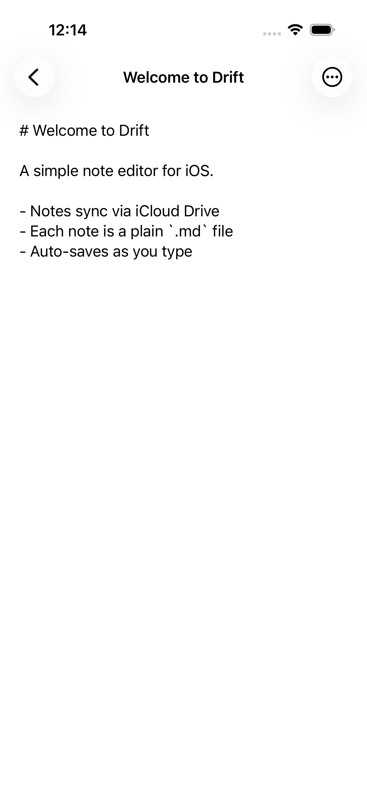
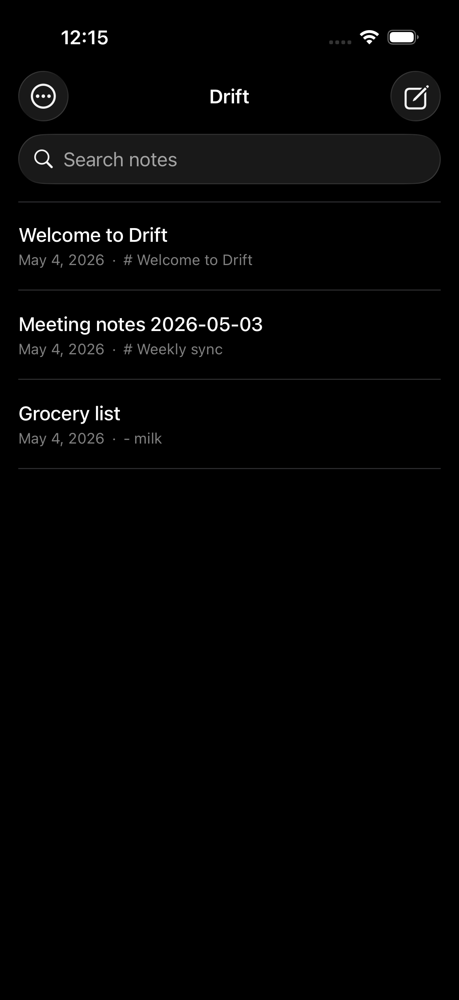

# Drift for iOS

A simple SwiftUI note editor that reads `.md` files from any folder you point it at — including iCloud Drive, which is how you sync with the desktop app.

## How it works

- Pick a folder once. The app stores a security-scoped bookmark and reuses it on every launch.
- Each note is a plain `.md` file in that folder. No proprietary format, no database.
- Auto-saves as you type (400ms debounce).
- Dark mode, search, swipe-to-delete, rename, pull-to-refresh, all the iOS-native niceties.
- No iCloud entitlement needed — sync is whatever the host folder gives you. Pick a folder inside iCloud Drive and you're synced.

## Build

```sh
brew install xcodegen
cd drift-ios
xcodegen generate
open Drift.xcodeproj
```

Or from the command line:

```sh
xcodebuild -project Drift.xcodeproj -scheme Drift -destination 'platform=iOS Simulator,name=iPhone 17 Pro' build CODE_SIGNING_ALLOWED=NO
```

## Test

```sh
xcodebuild -project Drift.xcodeproj -scheme Drift -destination 'platform=iOS Simulator,name=iPhone 17 Pro' test CODE_SIGNING_ALLOWED=NO
```

12 tests: 9 unit (`NoteStore` CRUD) + 3 UI (list rendering, tap-to-open, create-and-type).

## Test backdoor

Set `DRIFT_TEST_FOLDER=/some/path` in the launch environment to skip the folder picker and use a specific path. UI tests use this to seed a temp folder.

```sh
SIMCTL_CHILD_DRIFT_TEST_FOLDER=/path/to/notes xcrun simctl launch booted com.drift.notes
```

## Screenshots

| Empty | Notes list | Editor | Dark mode |
|---|---|---|---|
|  |  |  |  |
